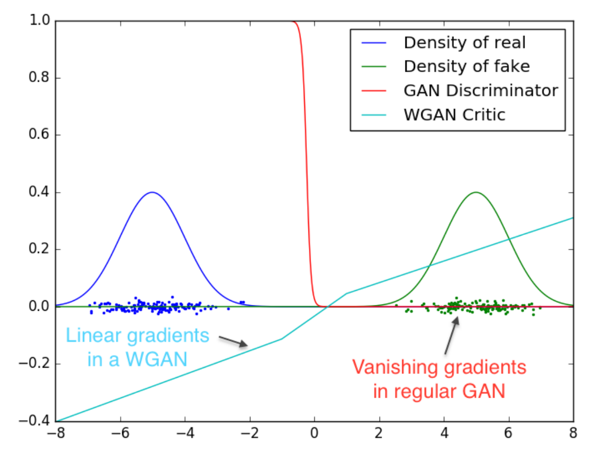
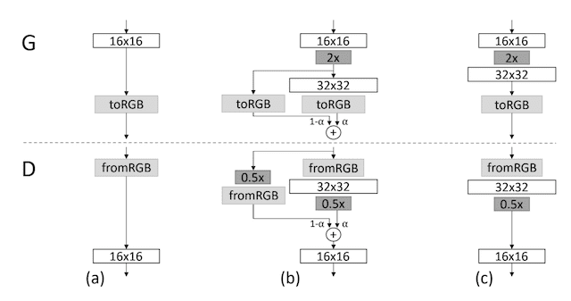
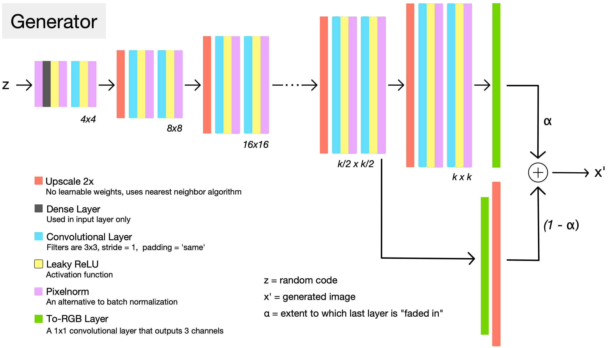
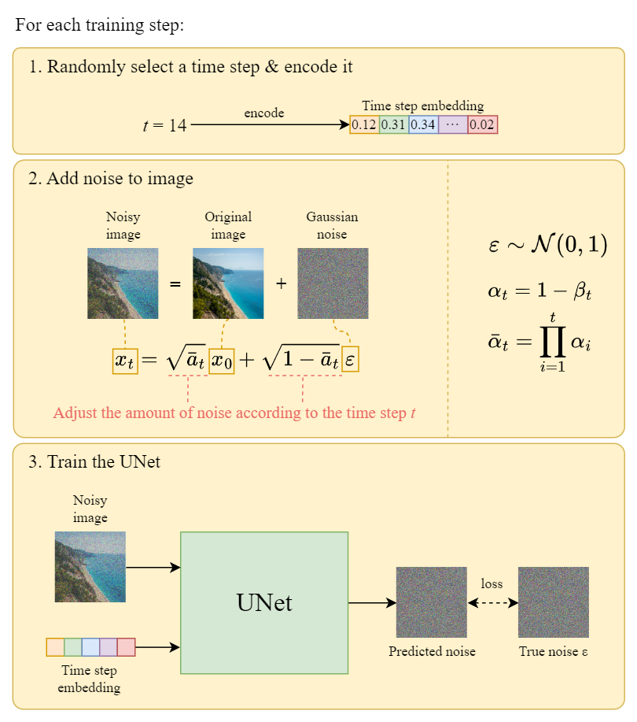
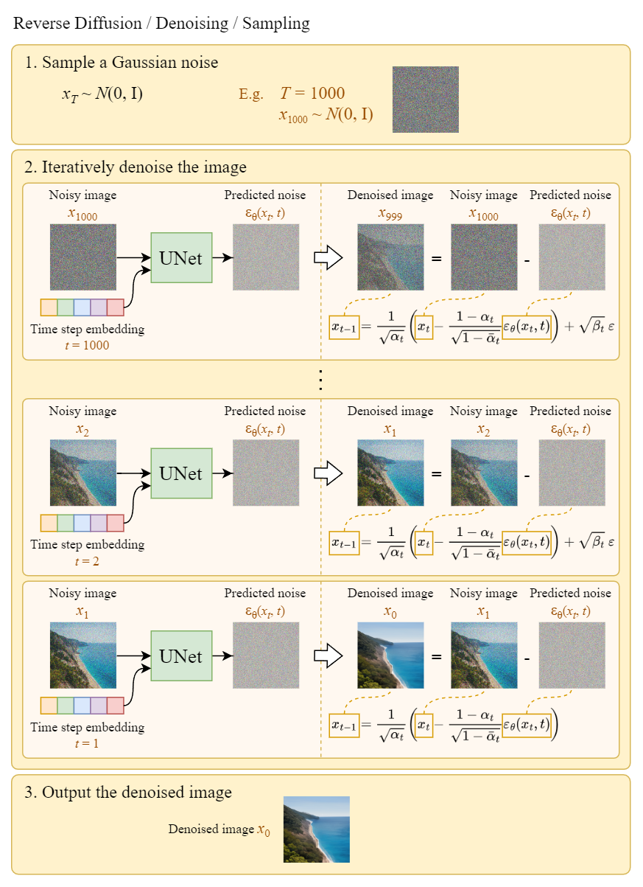

## [Deep Learning Image Generation with GANs and Diffusion Model](https://www.udemy.com/course/deep-learning-image-generation-with-gans-and-diffusion-model)

[Overview](https://learnopencv.com/image-generation-using-diffusion-models/)

|      | VAE                                           | GAN                                                                  | Diffusion                                                   |
|------|-----------------------------------------------|----------------------------------------------------------------------|-------------------------------------------------------------|
| Pros | Sampling is fast Diverse sample generation | Sampling is fast High sample generation quality                   | High sample generation quality Diverse sample generation |
| Cons | Low sample generation quality                 | Unstable training Low sample generation diversity (mode collapse) | Sampling is slow (but is fast with DDIM)

 

# WGAN

https://jonathan-hui.medium.com/gan-wasserstein-gan-wgan-gp-6a1a2aa1b490

In practice, GAN can optimize the discriminator easier than the generator. Assuming the discriminator is already optimal, when minimizing the GAN objective function, if two distributions are very distant (i.e. if the generated image has distribution far away from the ground truth), the divergence would be large, but the gradient of the divergency would eventually diminish. We would have a close-to-zero gradient, i.e. the generator learns nothing from the gradient descent.

For GAN (the red line), it fills with areas with diminishing or exploding gradients.

For WGAN (the blue line), the gradient is smoother everywhere and learns better even the generator is not producing good images.

Two significant contributions for WGAN are
- it has no sign of mode collapse in experiments, and
- the generator can still learn when the critic (discriminator) performs well.

 

# WGAN-GP

https://jonathan-hui.medium.com/gan-wasserstein-gan-wgan-gp-6a1a2aa1b490

Wasserstein GAN requires enforcing the Lipschitz constraint, but GAN’s weight clipping has issues. Instead of weight clipping, WGAN-GP uses gradient penalty to enforce the Lipschitz constraint. Gradient penalty penalizes the model if the gradient norm moves away from its target norm value 1.

Batch normalization is avoided for the WGAN-GP’s critic (discriminator). Batch normalization creates correlations between samples in the same batch. It impacts the effectiveness of the gradient penalty.

 

# Progressive Growing GAN (ProGAN)

https://machinelearningmastery.com/introduction-to-progressive-growing-generative-adversarial-networks/

https://towardsdatascience.com/progan-how-nvidia-generated-images-of-unprecedented-quality-51c98ec2cbd2

The image above shows the transition from 16 x 16 iamges (a) to 32 x 32 images (c) for doubling the resolution. During the transition (b), new layers are faded in smoothly. 

（Also check out the Discriminator layer diagram from reference link)

- Apart from the high resolution, ProGAN can be trained about 2–6 times faster than a corresponding traditional GAN.
- The phasing in of a new block of layers involves using a skip connection to connect the new block to the input of the discriminator or output of the generator, and adding it to the existing input or output layer with a weighting. The weighting controls the influence of the new block and is achieved using a parameter alpha (α) that starts at zero (or a very small number), and linearly increases to 1.0 over training iterations.
- All layers remain trainable during the training process, including existing layers when new layers are added.
- The upsampling method is nearest neighbor interpolation, which is different from many GAN generators that use a transpose convolutional layer. The downsampling method is average pooling, which is different from many GAN discriminators that use a 2×2 stride in the convolutional layers to downsample.
- Batch normalization is not used; instead, minibatch standard deviation and pixel-wise normalization are used.
    - Minibatch standard deviation: The standard deviation of activations across images in the mini-batch is added as a new channel prior to the last block of convolutional layers in the discriminator. This encourages the generator to produce more variety, such that statistics computed across a generated batch more closely resemble those from a training data batch.
    - Pixel-wise normalization: Normalizes the feature vector in each pixel (of all channels) to unit length, and is applied after the convolutional layers in the generator. This is to prevent signal magnitudes going out of control.
- Equalized Learning Rate: Before every forward pass during training, scale the weights of a layer according to how many weights that layer has.
- Image generation uses a weighted average of prior models rather a given model snapshot, much like a horizontal ensemble.)
- The paper uses WGAN-GP as the loss function, but can use other loss functions.

 

# Super Resolution GAN (SRGAN)

When producing higher resolution images, SRGAN is more appealing to a human with more details compared with the similar design without GAN (SRResNet). During the training, a high-resolution image (HR) is downsampled to a low-resolution image (LR). A GAN generator upsamples LR images to super-resolution images (SR). A discriminator is used to distinguish the HR images and backpropagate the GAN loss to train the discriminator and the generator.

The loss is the weighted sum of a Content Loss and an Adversarial Loss. For the Content Loss, a VGG-19 network is used as a feature extractor, and each generated SR (fake) image’s VGG output and its original HR (real) image’s VGG output VGG are compared pixel-wise (and MSE is calculated). The only way that the fake image’s VGG output and the real image’s VGG output will be similar is when the input images themselves are similar.

See formula: https://medium.com/@ramyahrgowda/srgan-paper-explained-3d2d575d09ff

 

# CycleGan

https://developers.arcgis.com/python/guide/how-cyclegan-works/

The model architecture is comprised of two generators: one generator (Generator-A) for generating images for the first domain (Domain-A) and the second generator (Generator-B) for generating images for the second domain (Domain-B).

    Domain-B -> Generator-A -> Domain-A
    Domain-A -> Generator-B -> Domain-B

Each generator has a corresponding discriminator model (Discriminator-A and Discriminator-B). The discriminator model takes real images from Domain and generated images from Generator to predict whether they are real or fake.

    Domain-A -> Discriminator-A -> [Real/Fake]
    Domain-B -> Generator-A -> Discriminator-A -> [Real/Fake]
    Domain-B -> Discriminator-B -> [Real/Fake]
    Domain-A -> Generator-B -> Discriminator-B -> [Real/Fake]
 

The loss used to train the Generators consists of three parts:

1. Adversarial Loss: Apply Adversarial Loss to both the Generators, where the Generator tries to generate the images of its domain, while its corresponding discriminator distinguishes between the translated samples and real samples. Generator aims to minimize this loss against its corresponding Discriminator that tries to maximize it.

2. Cycle Consistency Loss: It captures the intuition that if we translate the image from one domain to the other and back again, it should look the same as the original one. Hence, it calculates the L1 loss between the original image and the final generated image. It is calculated in two directions:

        Forward Cycle Consistency: Domain-B -> Generator-A -> Domain-A -> Generator-B -> Domain-B
        Backward Cycle Consistency: Domain-A -> Generator-B -> Domain-B -> Generator-A -> Domain-A

3. Identity Loss (me: this is optional): It encourages the generator to preserve the color composition between input and output. This is done by providing the generator an image of its target domain as an input and calculating the L1 loss between input and the generated images.

        Domain-A -> Generator-A -> Domain-A
        Domain-B -> Generator-B -> Domain-B

Popular applications: (1) Image-to-image translation: Translate images from one domain to another, for example, from sketches to photographs. Useful for generating training data for machine learning models. (2) Domain adaptation: Adapt a model trained on synthetic data to real data. (3) Data augmentation. (4) Anomaly detection: Often used in medical applications. (5) Denoising

Also see: https://hardikbansal.github.io/CycleGANBlog/

 

# Diffusion Models

See math details: https://medium.com/@steinsfu/diffusion-model-clearly-explained-cd331bd41166

See code examples:

- https://www.deeplearning.ai/short-courses/how-diffusion-models-work/
- https://github.com/huggingface/diffusion-models-class

### Why don't we just denoise in a single large step?

For low noise, denoising is easy. For high noise, denoising is hard; the results tend to be blurry.

### Class-Conditioned UNet

If the image shape is (bs, 3, 28, 28), and class embedding size is 4 (i.e. 4 numbers are enough to encode all classes), then the class embedding shape is (bs, 4, 28, 28) (i.e. same 4 numbers for each pixal), and the concatenated shape is (bs, 3 + 4, 28, 28)

### Fine-Tuning

Fine-tune a trained diffusion model (trained on a dataset from the same or a different domain) on a target dataset, so that it can generate target images.

### Guidance

While a conditional model can takes additional inputs to control the generation process, the Guidance technique can control a trained unconditional model, i.e. the generated image at each step in the generation process is pushed to lower loss according to the guidance function (a user-defined loss function). Specifically, calculate the gradient of this loss with respect to the current noisy x and use this gradient to modify x before updating it with the scheduler.

For example:

    def loss(generated_image, prompt_text)
        image_features = openai_clip_model.encode_image(generated_image)
        text_features = openai_clip_model.encode_text(prompt_text)
        return distance between image_features and text_features

### Classifier-Free Guidance (CGF)

During training, text conditioning is sometimes kept blank, forcing the model to learn to denoise images with no text information (unconditional generation). Then at inference time, make two separate predictions: one with the text prompt as conditioning and one without. Then use the difference between these two predictions to create a final combined prediction that pushes even further in the direction indicated by the text-conditioned prediction.

### Stable Diffusion Text to Image Sampling Process

During training, it is worth mentioning that a pre-trained VAE encoder is used to generate VAE latent tensors as inputs to a U-Net (rather than using full-resolution images) for lower memory usage, fewer layers needed in the U-Net, and faster generation time.

During sampling, a U-Net that takes (1) text embedding (transformed from a prompt), (2) noise (random numbers in the shape of the VAE latent tensor), (3) timestep, and outputs noise in the shape of VAE latent tensor which is then decoded (using a pre-trained VAE decoder) into an image.

### Stable Diffusion Img2Img Sampling Process

An Img2Img pipeline first encodes an existing image into a latent tensor, then adds some noise to the latent tensor, and uses that (instead of pure random numbers) as the noise input of the U-Net. Img2Img is for preserving the image structure.
